# 一、工具准备

#### 因为new bing不对中国大陆开放，所以要想使用new bing就必须要使用魔法，这里推荐使用Clash

#### 下载地址：https://wwss.lanzoum.com/i0sGY0whliti      密码:7gnm

#### 解压后，双击Clash for Windows.exe打开文件，界面如下图，General设置按照图示将Systerm Proxy打开：

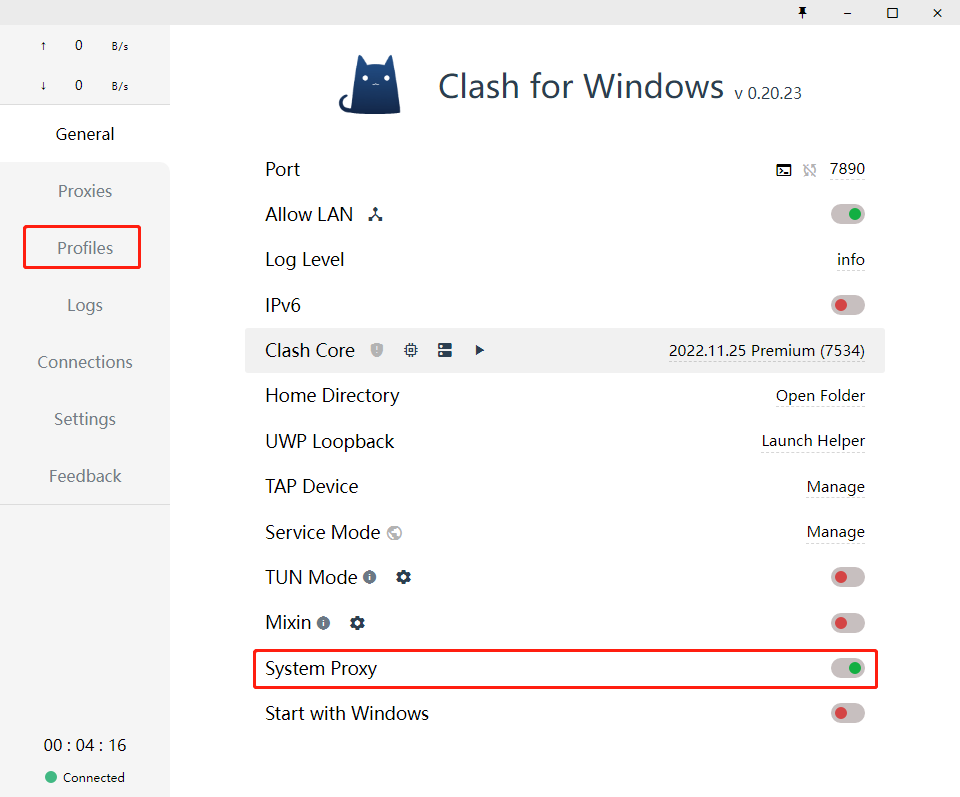

#### 进入Profiles配置节点信息，这个是导入代理节点的地方，推荐一个免费的机场，每日更新：

#### [FreeNode | Clash/V2ray免费节点订阅链](https://freenode.me/)

#### 这个网站每天更新免费节点和共享账号，选择免费节点进入，拉到网页的最后，如下图所示，复制这个链接。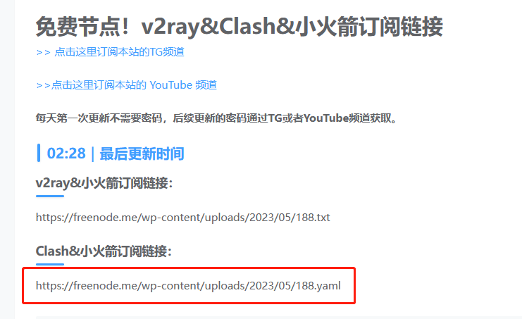

#### 回到Clash的Profiles界面，将刚才复制的链接粘贴到输入栏中，点击Download下载配置文件。

#### 有时可能会出现报错，如果报错可以试试将链接复制到浏览器上打开，会自动下载一个.yaml文件，这个文件就是我们Clash的配置文件，点击Import导入刚才下载的配置文件。

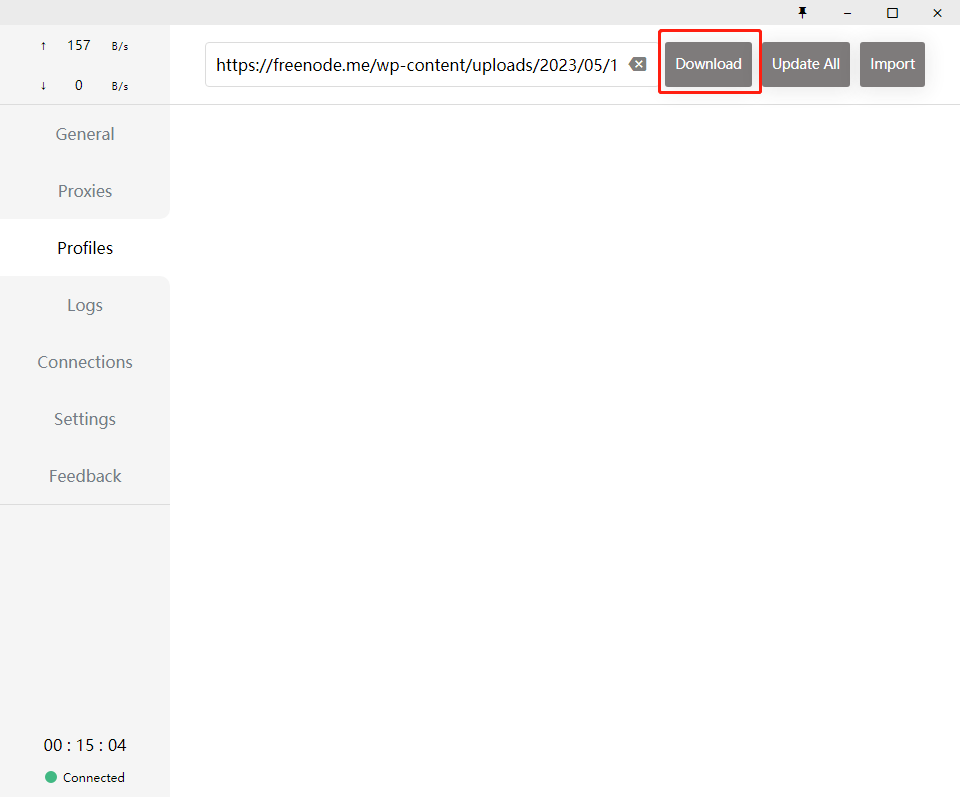

#### 导入配置文件成功后就可以在Proxies界面看到我们刚才导入的节点信息啦，最上面一排的规则我们选择Rule，也就是自动判断，智能识别网站，可以实现国内的网站不经过代理。

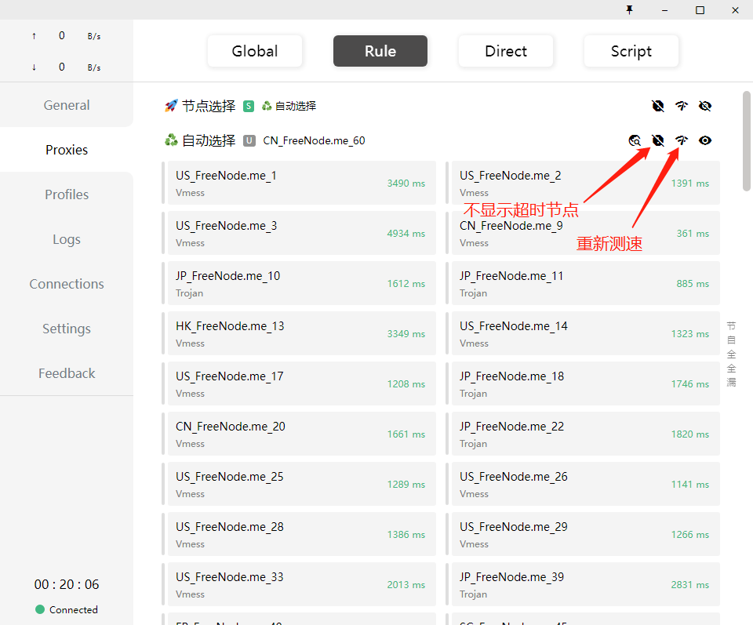

# 二、Bing账号注册

#### 需要注册一个美区的outlook邮箱，用来注册登录微软账号，否则就算使用魔法打开了new bing，也会一直提示登录而导致无法使用。

#### 注意：注册账号过程中全程不要使用魔法！！！

#### 打开Edge浏览器，点击右上角头像，点击【添加用户配置】，会新弹出一个浏览器，点击【在不使用你的数据情况下开始】，按照提示一步一步完成进入浏览器主界面（如果之前没登陆过可以直接开始下一步）。

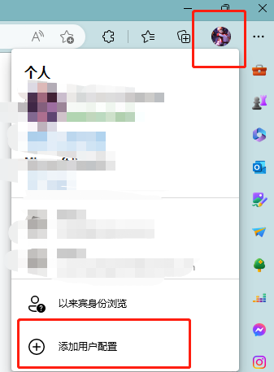

#### 获取一个新的电子邮件，点击右上角头像，【登录以同步数据】，接下来按照提示走就可以，唯一需要注意的就是【国家/地区】，一定要选择美国！！！切记！！！

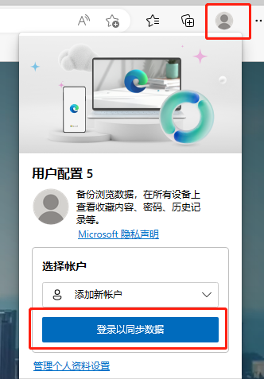

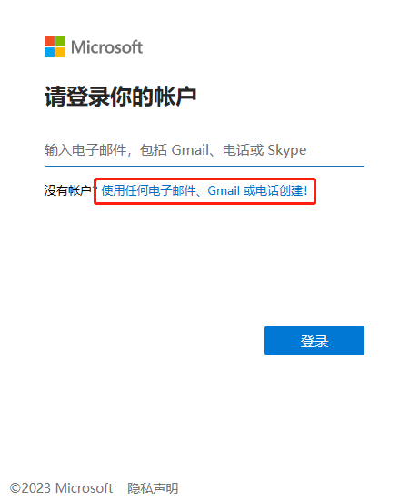

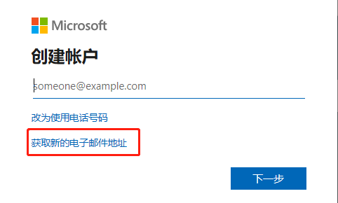

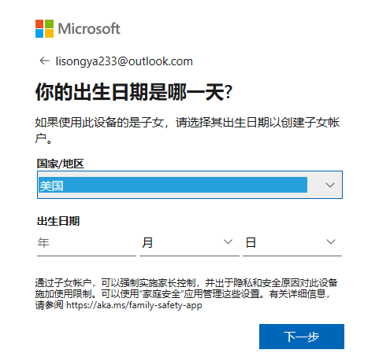

# 三、使用new bing

#### 经过上面几步，我们已经注册了一个美区的账号并且登录，然后就可以随便在搜索框中输入点什么东西，比如我输入chat，正常情况下会在搜索框下直接出现new bing，点击就可以进入啦。

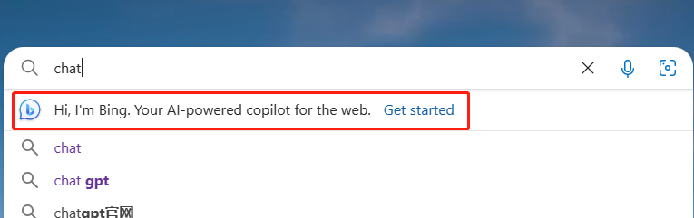

#### 如果没有出现也没关系，回车搜索会出现下面的界面，点击其中的【聊天】同样也能进入new bing

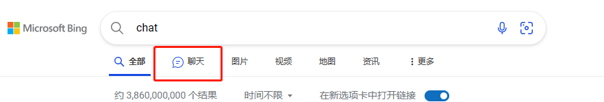

#### 测试的过程中出现了另外一个问题，就是反复的提示【聊天模式只有在你访问了新必应之后才能使用】，点击之后贪吃一个新的网页还是让访问新必应，本来我已经认为注册失败的，结果第二天登陆账号一试，能用了！！！

#### 所以如果你也出现了类似的问题，不妨等一等，可能这并不是你的问题。
